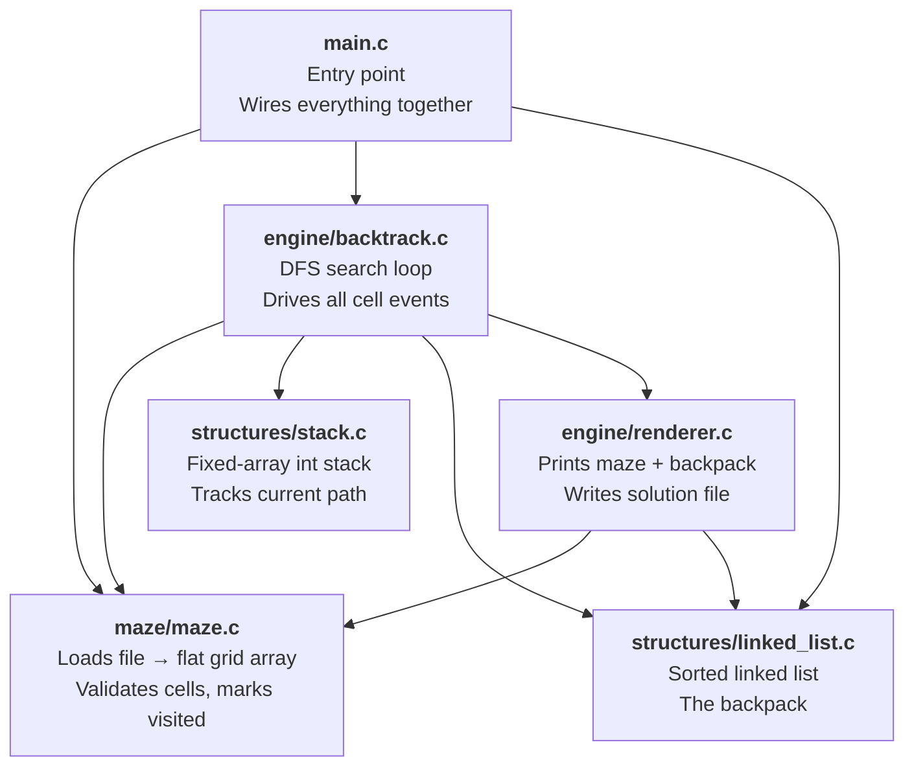
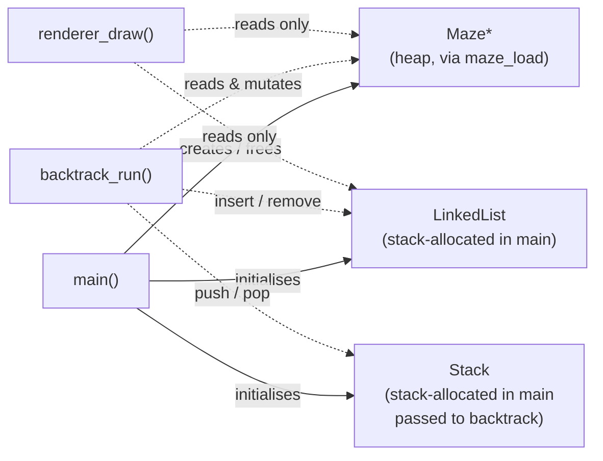
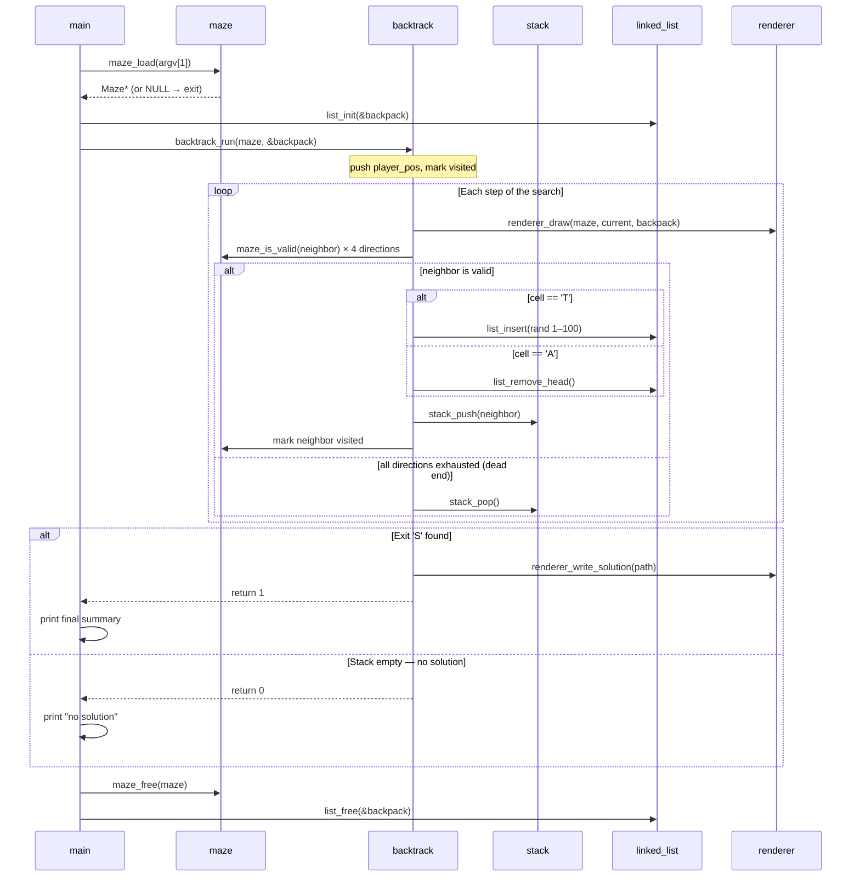
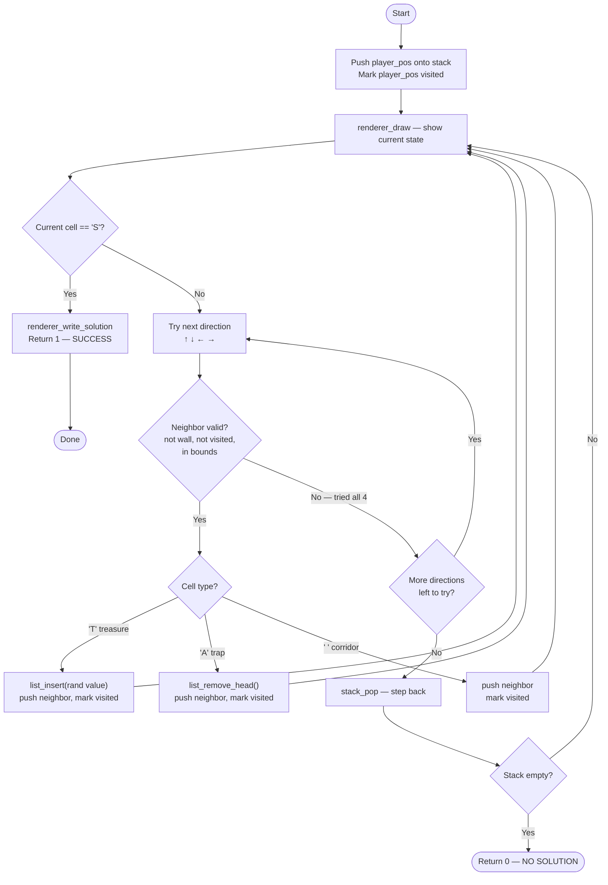

# Architecture & Flow

Visual overview of how the modules interact and what each one is responsible for.

---

## 1. Module Dependency Map

Who knows about whom at compile time. Arrows mean "depends on / includes".



**Key rule:** data structures (`stack`, `linked_list`) and `maze` have zero internal dependencies — they are the foundation. `backtrack` is the only module that orchestrates all the others. `main` only sets up and tears down.

---

## 2. Ownership of Data

Each live object is owned by exactly one place.



---

## 3. Runtime Sequence

What happens from `./maze mazes/maze_10x10.txt` to program exit.



---

## 4. Backtracking Algorithm

The core loop inside `backtrack_run`.



---

## 5. Data Structure Roles

### Stack — the path memory

```
push(3)  push(4)  push(9)  pop()   peek()
  [3]   [3,4]  [3,4,9] [3,4]    → 4

Stores 1D cell indices. Top = current position.
Pop = backtrack one step.
```

The stack is never cleared mid-run; it accumulates the winning path when the exit is reached.

### LinkedList — the backpack

```
insert(40)   insert(15)   insert(75)   remove_head()   insert(60)
  [40]       [15,40]    [15,40,75]       [40,75]       [40,60,75]
              ^sorted                    ^15 lost
                                         (trap hit)
```

Always sorted ascending so the **head is always the cheapest treasure** — the one sacrificed on a trap, minimising total loss. `list_insert` walks to the correct position; `list_remove_head` is O(1).

---

## 6. Maze Memory Layout

The maze is stored as a **flat 1D array** of `char` (row-major order). A 4×5 grid:

```
Row 0: cells[0]  cells[1]  cells[2]  cells[3]  cells[4]
Row 1: cells[5]  cells[6]  cells[7]  cells[8]  cells[9]
Row 2: cells[10] cells[11] cells[12] cells[13] cells[14]
Row 3: cells[15] cells[16] cells[17] cells[18] cells[19]

index(row, col) = row * cols + col

Direction offsets (cols = 5):
  UP    = -5   (index - cols)
  DOWN  = +5   (index + cols)
  LEFT  = -1
  RIGHT = +1
```

Boundary check for LEFT/RIGHT must also verify the column doesn't wrap (e.g., index 5 going LEFT must not land on index 4 of the row above).
