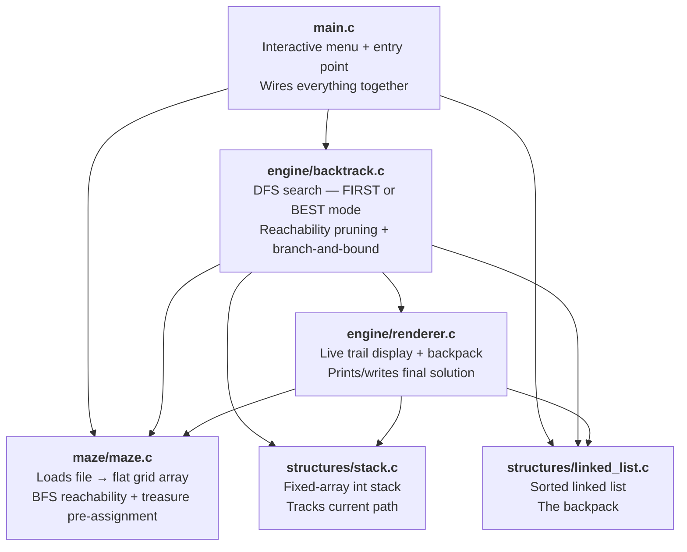
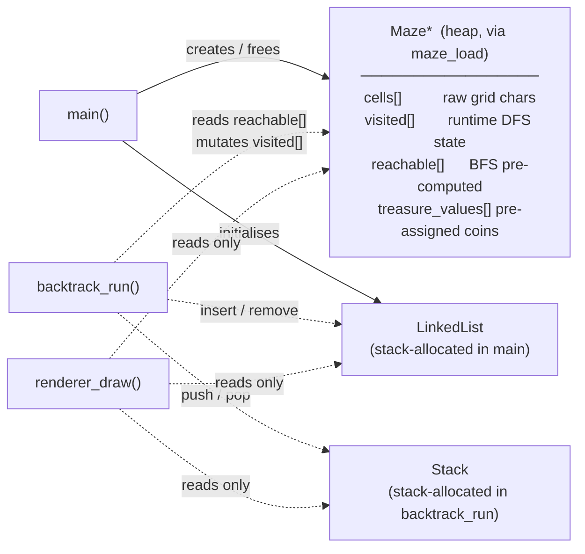
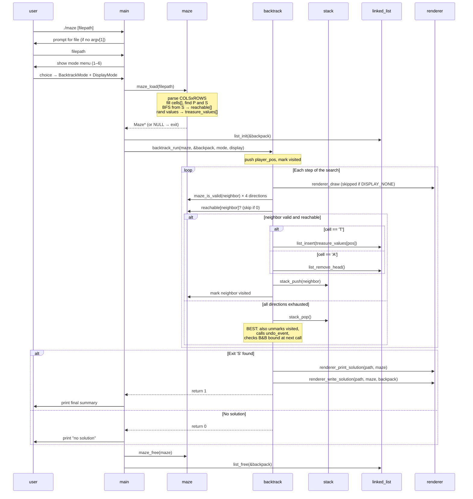
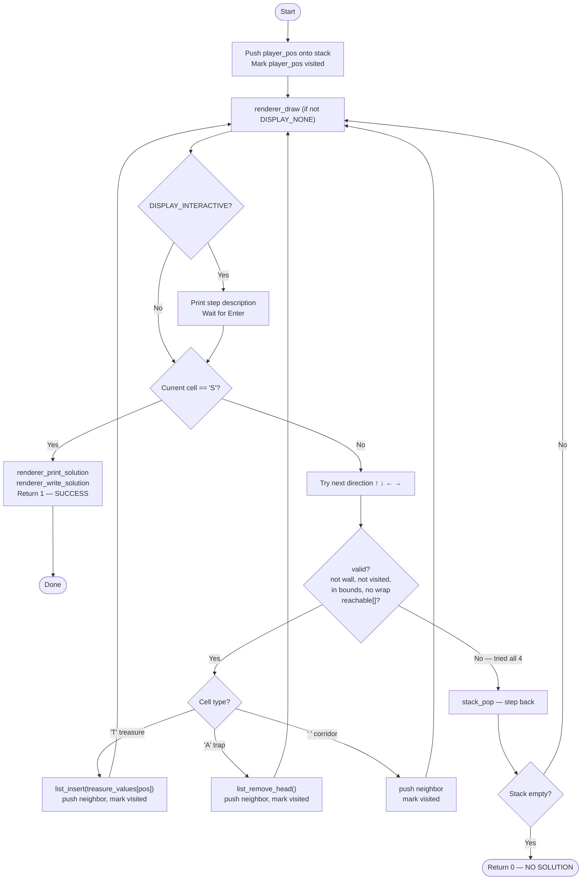
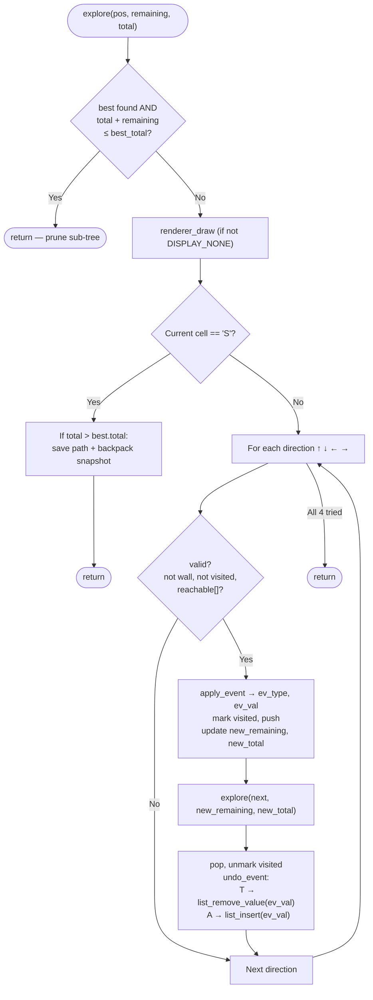

# Architecture & Flow

Visual overview of how the modules interact and what each one is responsible for.

> For the search optimizations applied to `BACKTRACK_BEST` (reachability pre-computation and branch and bound), see [`optimizations.md`](optimizations.md).

## 1. Module Dependency Map

Who knows about whom at compile time. Arrows mean "depends on / includes".



**Key rule:** data structures (`stack`, `linked_list`) and `maze` have zero internal dependencies — they are the foundation. `backtrack` is the only module that orchestrates all the others. `main` only sets up and tears down.

## 2. Ownership of Data

Each live object is owned by exactly one place.



## 3. Runtime Sequence

Full flow from launch to program exit.



## 4. Backtracking Modes

### BACKTRACK_FIRST — Iterative DFS

Stops at the first exit reached. Non-reachable neighbors are skipped via the `reachable[]` pre-computation.



### BACKTRACK_BEST — Recursive DFS with Undo + Branch and Bound

Explores all paths. Pruned by reachability and by the upper-bound check `current_total + remaining_treasure <= best_total`. On backtrack, reverses cell events using a `CellEvent` array; `current_total` and `remaining_treasure` are passed by value so undo is implicit.



After all `explore` calls return to `run_best`: restore winning path into caller's stack and rebuild backpack from saved snapshot.

## 5. Data Structure Roles

### Stack — the path memory

```
push(3)  push(4)  push(9)  pop()   peek()
  [3]   [3,4]  [3,4,9] [3,4]    → 4

Stores 1D cell indices. Top = current position.
Pop = backtrack one step.
```

`renderer_draw` uses the full stack contents to mark trail cells (`.`) on the display.

### LinkedList — the backpack

```
insert(40)   insert(15)   insert(75)   remove_head()   insert(60)
  [40]       [15,40]    [15,40,75]       [40,75]       [40,60,75]
              ^sorted                    ^15 lost
                                         (trap hit)
```

Always sorted ascending so the **head is always the cheapest treasure** — the one sacrificed on a trap, minimising total loss.

- `list_insert`: O(n) walk to correct position
- `list_remove_head`: O(1) — always used by traps
- `list_remove_value`: O(n) — used by best-path undo to reverse a treasure pickup

## 6. Maze Memory Layout

The maze is stored as a **flat 1D array** of `char` (row-major order). The `Maze` struct carries four parallel arrays over the same index space:

```
cells[i]           — raw cell char from the file ('P', 'T', 'A', 'S', ' ', '#')
visited[i]         — 0/1, mutated during DFS, reset on backtrack (BEST mode)
reachable[i]       — 0/1, computed once at load by BFS from exit, never mutated
treasure_values[i] — pre-assigned coin value (1–100) for CELL_TREASURE cells, 0 otherwise
```

Index formula for a 4×5 grid (cols = 5):

```
Row 0: cells[0]  cells[1]  cells[2]  cells[3]  cells[4]
Row 1: cells[5]  cells[6]  cells[7]  cells[8]  cells[9]
...

index(row, col) = row * cols + col

Direction offsets:
  UP    = −cols   DOWN  = +cols   LEFT  = −1   RIGHT = +1
```

**Column-wrap guard:** before moving LEFT, check `current % cols == 0`; before RIGHT, check `current % cols == cols − 1`. Without this, the algorithm silently steps from the end of one row to the start of the next.
