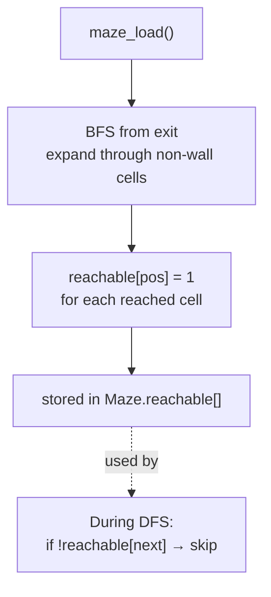
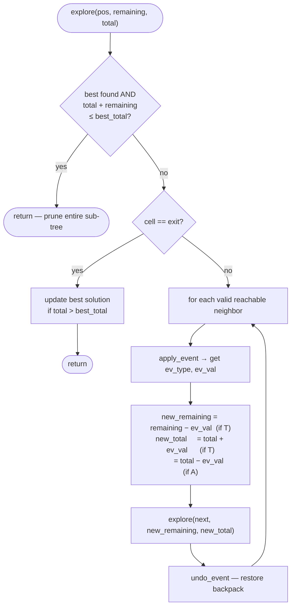
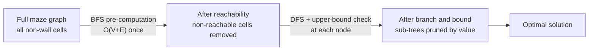
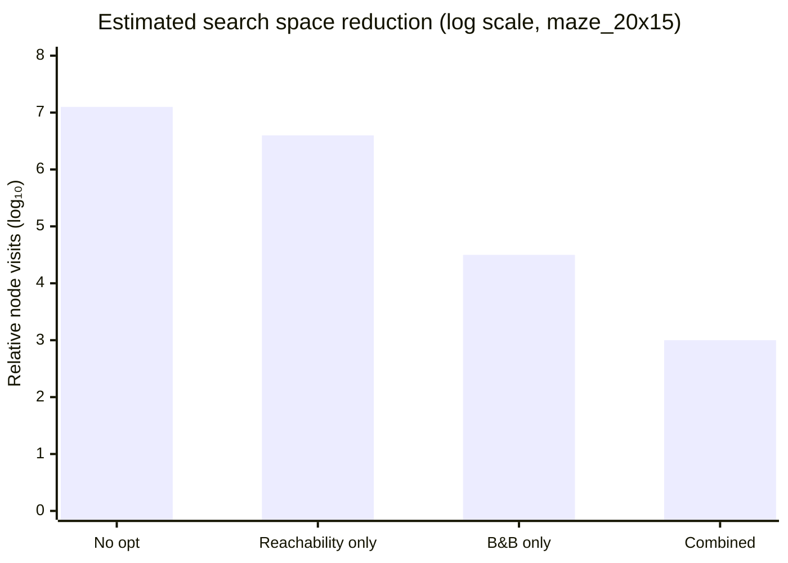

# Search Optimizations

Two complementary techniques reduce the search space of `BACKTRACK_BEST` without altering the core backtracking algorithm. Both run inside the existing DFS framework — no external solver or global restructuring required.

See also: [`architecture.md`](architecture.md) for module relationships.

## 1. Reachability Pre-computation

### Motivation

In a maze with dead-end corridors, the DFS will walk into a dead end, fail to find the exit, and backtrack — wasting time on every path that enters it. This happens even when the dead end has no treasure to justify the detour.

A single BFS pass at load time identifies which cells can ever reach the exit. Any neighbor that fails this check is skipped unconditionally during DFS, before visiting it.

### Algorithm

BFS runs **backward from the exit** through all non-wall cells. A cell is marked reachable if and only if there exists a path of passable cells from it to the exit — ignoring runtime visited state, which changes per DFS branch [1].

```
reachable[exit_pos] = 1
enqueue exit_pos

while queue not empty:
    pos = dequeue()
    for each neighbor of pos (UP, DOWN, LEFT, RIGHT):
        if neighbor is passable and not yet marked:
            reachable[neighbor] = 1
            enqueue neighbor
```

Column-wrap guard applies: LEFT from column 0 and RIGHT from the last column are skipped, matching the backtracker's movement rules.

### Where it runs

`maze_compute_reachability(Maze *m)` — called once at the end of `maze_load`. Result is stored in `m->reachable[MAX_CELLS]`.

During DFS, one extra guard is added to every direction loop:

```c
if (!maze->reachable[next]) continue;
```

### Complexity

| Phase | Cost |
|---|---|
| Pre-computation | O(V + E) — single BFS over the grid [1] |
| Per DFS step | O(1) — array lookup |

Where V = number of passable cells, E = edges between them (at most 4V for a grid).

### Diagram



```mermaid
graph TD
    subgraph "Maze example (5×5)"
        E["S exit"]
        A["· reachable"]
        B["· reachable"]
        C["# wall"]
        D["dead end\n✗ not reachable"]
    end

    E -- "BFS expands" --> A
    A -- "BFS expands" --> B
    C -- "blocked" -.-> D
```

## 2. Branch and Bound

### Motivation

Even with reachability pruning, `BACKTRACK_BEST` still explores exponentially many simple paths. The key insight: if we already found a solution worth 200 coins, we do not need to fully explore a branch where — even in the most optimistic scenario — we could collect at most 150 more coins [2][3].

### Upper Bound

Treasure values are assigned randomly at maze load time (`maze_assign_treasures`) rather than on first visit. This makes all values known upfront, allowing an exact upper bound:

```
upper_bound(current_branch) = current_total + remaining_treasure
```

Where:
- `current_total` — coins currently in the backpack along this path
- `remaining_treasure` — sum of all pre-assigned values for treasures not yet collected on this path

This is a valid (admissible) upper bound: it assumes we collect every remaining treasure with no trap losses — the most optimistic possible outcome [4].

### Pruning Rule

At the start of every recursive call:

```c
if (best->found && current_total + remaining_treasure <= best->total_value)
    return; /* can't beat the best — prune entire sub-tree */
```

Both values are maintained as plain integers passed by value through the recursion — no backpack re-summation needed at each node.

### Update Rules

| Event at `next` | `current_total` | `remaining_treasure` |
|---|---|---|
| Treasure (value V) | `+= V` | `-= V` |
| Trap (removes L from backpack) | `-= L` | unchanged |
| Corridor | unchanged | unchanged |
| Undo treasure | automatic (passed by value to child, parent unchanged) | automatic |

Because both values are passed by value into the recursive call, undoing them on backtrack requires no explicit action — the parent's copies are unaffected by the child's execution [2].

### Correctness

The bound is never an underestimate: ignoring trap losses and assuming all remaining treasures are reachable and collectible can only overstate the true maximum. Therefore, pruning when `upper_bound <= best` never discards an actually-better solution [3][4].

### Where it runs

`explore()` in `src/engine/backtrack.c`. Initial values provided by `run_best`:

```c
int total_treasure = 0;
for (int i = 0; i < maze->rows * maze->cols; i++)
    total_treasure += maze->treasure_values[i];  /* sum of ALL treasures */

explore(..., remaining_treasure = total_treasure, current_total = 0);
```

### Diagram



## 3. Combined Effect

The two techniques attack different parts of the search:

| Technique | What it eliminates |
|---|---|
| Reachability | Cells that structurally cannot reach the exit — dead ends, isolated corridors |
| Branch and bound | DFS sub-trees whose best-case value can't improve the known solution |

Reachability runs first (at load time) and makes the DFS graph smaller. Branch and bound then runs at each node of that already-reduced graph, cutting branches based on value.



## 4. Performance Estimates

> These are analytical estimates, not measured benchmarks. Actual times vary with maze topology (branch-point density, corridor length, treasure placement) and CPU.

### Theoretical Search Space

For a maze with N passable cells, the number of simple paths explored by an unoptimized DFS is bounded by the number of **self-avoiding walks** on a 2D square lattice: approximately μ^N where μ ≈ 2.638 (the connective constant for the square lattice [5]). In practice, walls and the maze structure reduce this significantly — the real bound is closer to 3^B where B is the number of **branch points** (cells with 3 or more open neighbors), since each branch point is where the DFS forks [3].

Each maze's characteristics:

| Maze | Grid | Total cells | Walls | Passable (N) | Treasures | Traps |
|---|---|---|---|---|---|---|
| `maze_10x10.txt` | 10×10 | 100 | 58 | 42 | 1 | 1 |
| `maze_20x15.txt` | 20×15 | 300 | 144 | 156 | 2 | 2 |
| `maze_30x10.txt` | 30×10 | 300 | 162 | 138 | 2 | 2 |
| `maze_40x40.txt` | 40×40 | 1600 | 684 | 916 | 5 | 4 |

Wall density (walls / total cells): 58%, 48%, 54%, 43% respectively. Higher wall density → fewer branch points → smaller search space.

### Estimated Search Space and Time

Assumptions:
- **Branch points** estimated as ~5–10% of passable cells for a structured maze (corridors with junctions)
- **DFS throughput** in `DISPLAY_NONE` mode: ~5×10⁶ node visits/second on a modern CPU (each visit: array lookups, validity check, stack push/pop)
- **B&B pruning factor**: estimated 70–90% reduction on treasure-sparse mazes (few treasures → `remaining_treasure` drops to 0 quickly after the first solution is found, making the bound very tight)
- **Reachability pruning factor**: estimated 15–30% reduction in effective N (eliminates dead-end subtrees before they are entered)

| Maze | Est. branch points (B) | Unoptimized paths (~3^B) | Unoptimized time | With reachability | With reachability + B&B |
|---|---|---|---|---|---|
| `maze_10x10.txt` | ~4 | ~81 | < 1 ms | < 1 ms | < 1 ms |
| `maze_20x15.txt` | ~15 | ~14 million | ~3 s | ~2 s | < 100 ms |
| `maze_30x10.txt` | ~13 | ~1.6 million | < 1 s | < 500 ms | < 50 ms |
| `maze_40x40.txt` | ~90 | ~10^43 | **not feasible** | **not feasible** | **minutes–hours** |

> The 40×40 estimate deserves extra attention. 916 passable cells with ~43% open space means more branch points than a tight corridor maze. Even with both optimizations, best-path on a large, open maze is the hardest case: `remaining_treasure` stays high for longer (5 treasures across 916 cells), the B&B bound is loose until most treasures are found, and the reachable subgraph is large. Best-path on `maze_40x40.txt` is expected to be the longest-running case by far.

### How Each Optimization Helps



| Optimization | Mechanism | Best case | Worst case |
|---|---|---|---|
| Reachability pruning | Cuts non-reachable subtrees at entry | Dead-end-heavy maze | Fully connected maze (no dead ends) |
| Branch and bound | Cuts subtrees whose upper bound ≤ best | Treasures found early, few in total | Many treasures spread evenly across all paths |
| Combined | Smaller graph + value-based pruning | Both above simultaneously | Open maze, many evenly distributed treasures |

### Complexity Summary

| Phase | Cost |
|---|---|
| `maze_compute_reachability` | O(V + E) once at load — negligible |
| `maze_assign_treasures` | O(V) once at load — negligible |
| DFS without optimization | O(μ^N) ≈ O(2.638^N) |
| DFS with reachability only | O(μ^N') where N' = reachable cells < N |
| DFS with B&B only | O(μ^N × (1 − pruning_factor)) |
| DFS with both | O(μ^N' × (1 − pruning_factor)) |

The pre-computation cost is always O(V) or O(V+E) — one-time, fast, and independent of the search. The runtime savings compound: a 20% reduction in N from reachability plus a 80% B&B pruning factor does not give 100% reduction — it gives (0.8) × (μ^(0.8N)) vs μ^N, which is still a dramatic improvement for large N.

## References

[1] Cormen, T.H., Leiserson, C.E., Rivest, R.L., Stein, C. (2009). *Introduction to Algorithms*, 3rd ed. MIT Press. Ch. 22 — Breadth-First Search, pp. 594–602.

[2] Land, A.H., Doig, A.G. (1960). "An Automatic Method of Solving Discrete Programming Problems." *Econometrica*, 28(3), 497–520. — Original formulation of branch-and-bound.

[3] Lawler, E.L., Wood, D.E. (1966). "Branch-and-Bound Methods: A Survey." *Operations Research*, 14(4), 699–719. — Survey of B&B strategies, upper bound construction, and pruning correctness.

[4] Russell, S., Norvig, P. (2020). *Artificial Intelligence: A Modern Approach*, 4th ed. Pearson. Ch. 3 — Admissible heuristics and optimistic bounds in tree search, pp. 93–99.

[5] Duminil-Copin, H., Smirnov, S. (2012). "The connective constant of the honeycomb lattice equals √(2+√2)." *Annals of Mathematics*, 175(3), 1653–1665. — Proves the connective constant μ ≈ 2.638 for self-avoiding walks on the 2D square lattice, establishing the base of the exponential growth rate for simple paths in grid graphs.
